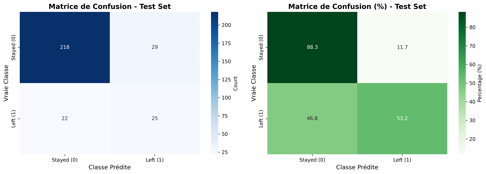
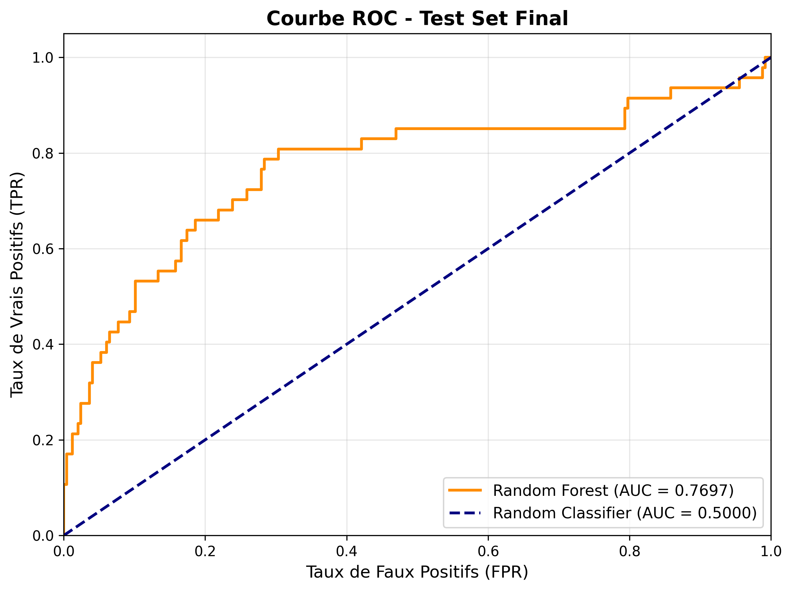
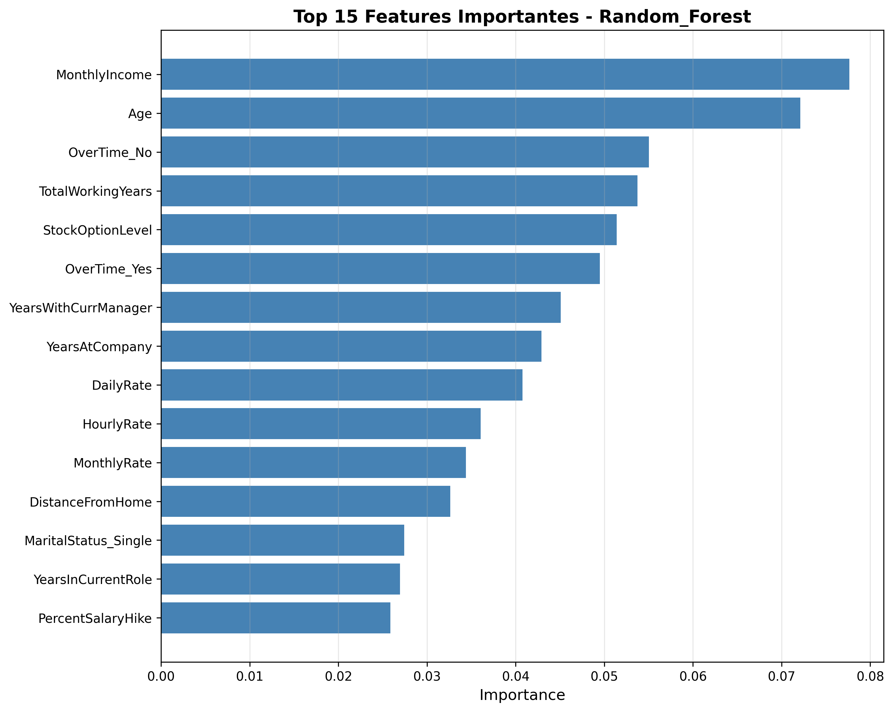
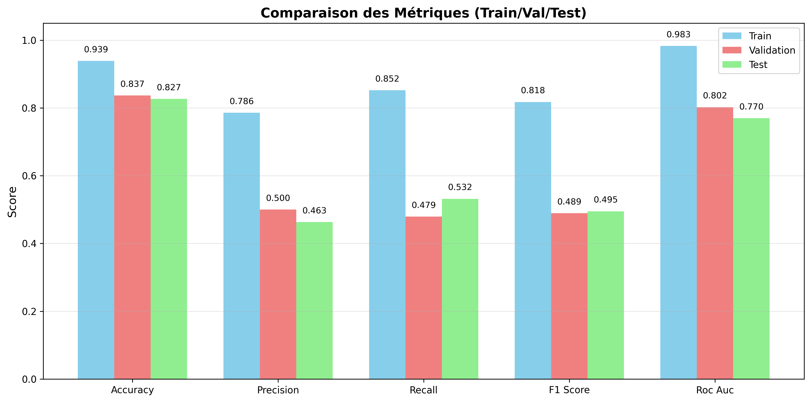

# 🎯 Prédiction de l'Attrition des Employés


**Mini-projet Machine Learning - 4ème année Informatique et Réseaux**

Projet de classification binaire pour prédire l'attrition (départ) des employés au sein d'une entreprise en utilisant des techniques d'apprentissage automatique supervisé. Ce projet implémente un pipeline ML complet, de l'analyse exploratoire au déploiement d'une application interactive.

---

## 📋 Table des matières

- [Description](#-description)
- [Structure du projet](#-structure-du-projet)
- [Installation](#-installation)
- [Utilisation](#-utilisation)
- [Méthodologie](#-méthodologie)
- [Résultats](#-résultats)
- [Auteur](#-auteur)

---

## 📖 Description

Ce projet implémente un **pipeline complet de Machine Learning** pour prédire l'attrition des employés :

- **Objectif** : Prédire si un employé va quitter l'entreprise (Attrition = Yes/No)
- **Type de problème** : Classification binaire supervisée
- **Dataset** : IBM HR Analytics Employee Attrition (1470 employés, 35 features)
- **Algorithmes testés** : Logistic Regression, Random Forest, XGBoost
- **Meilleur modèle** : 🏆 Random Forest (ROC-AUC: 0.770 sur test set)
- **Déploiement** : Application Streamlit interactive pour prédictions en temps réel

### 🎓 Concepts ML couverts

✅ **Preprocessing**
- Split stratifié (train/val/test)
- Gestion des valeurs manquantes
- Encodage (ordinal + one-hot)
- Normalisation/Standardisation
- Détection des outliers

✅ **Modélisation**
- Modèles supervisés (classification)
- Gestion du déséquilibre de classes
- Hyperparameter tuning (GridSearchCV)
- Cross-validation (k-fold)

✅ **Évaluation**
- Métriques multiples (Accuracy, Precision, Recall, F1, ROC-AUC)
- Matrices de confusion
- Courbes ROC
- Analyse overfitting/underfitting

---

## 📁 Structure du projet

```
HR_ANALYTICS/
├── data/
│   └── employee_attrition.csv          # Dataset
│
├── models/                              # Modèles entraînés
│   ├── preprocessing_pipeline.pkl      # Pipeline de preprocessing
│   ├── feature_names.pkl               # Noms des features
│   ├── best_model.pkl                  # Meilleur modèle
│   ├── best_model_info.json            # Infos du meilleur modèle
│   ├── random_forest.pkl               # Random Forest tuné
│   ├── xgboost.pkl                     # XGBoost tuné
│   └── *_params.json / *_metrics.json  # Hyperparamètres et métriques
│
├── reports/                             # Résultats et visualisations
│   ├── eda_report.txt                  # Rapport EDA
│   ├── preprocessing_summary.txt       # Résumé preprocessing
│   ├── final_evaluation_report.txt     # Rapport final
│   ├── baseline_comparison.csv         # Comparaison modèles
│   ├── confusion_matrix_*.png          # Matrices de confusion
│   ├── roc_curves_*.png                # Courbes ROC
│   ├── feature_importance_*.png        # Features importantes
│   ├── target_distribution.png         # Distribution cible
│   ├── correlations_with_attrition.png # Corrélations
│   └── metrics_comparison.png          # Comparaison métriques
│
├── src/
│   ├── preprocessing.py                # Script de preprocessing
│   ├── train_models.py                 # Script d'entraînement
│   ├── evaluate_model.py               # Script d'évaluation
│   └── eda.py                          # Analyse exploratoire
│
├── requirements.txt                     # Dépendances Python
└── README.md                            # Documentation
```

---

## 🚀 Installation

### 1. Cloner le repository

```bash
git clone <repository_url>
cd HR_ANALYTICS
```

### 2. Créer un environnement virtuel (recommandé)

```bash
python -m venv venv

# Windows
venv\Scripts\activate

# Linux/Mac
source venv/bin/activate
```

### 3. Installer les dépendances

```bash
pip install -r requirements.txt
```

---

## 💻 Utilisation

### Option 1 : Application Interactive Streamlit (Recommandé) 🚀

Lancez l'interface web pour faire des prédictions en temps réel :

```bash
streamlit run app.py
```

L'application permet de :
- ✅ Saisir les informations d'un employé via un formulaire intuitif
- ✅ Obtenir une prédiction instantanée (Risque faible/élevé de départ)
- ✅ Visualiser les probabilités et feature importance
- ✅ Recevoir des recommandations RH personnalisées

### Option 2 : Workflow complet (Entraînement + Évaluation)

#### Étape 1 : Analyse exploratoire (EDA)

```bash
cd src
python eda.py
```

**Génère :**
- Visualisations de la distribution des données
- Corrélations avec la variable cible
- Analyse des features catégorielles et numériques
- Rapport EDA complet

### Étape 2 : Preprocessing + Entraînement

```bash
python train_models.py
```

**Effectue :**
1. Split stratifié des données (60% train, 20% val, 20% test)
2. Preprocessing (imputation, encodage, scaling)
3. Entraînement de modèles baseline
4. Hyperparameter tuning (GridSearchCV)
5. Sélection du meilleur modèle
6. Génération des visualisations

### Étape 3 : Évaluation finale sur test set

```bash
python evaluate_model.py
```

**Génère :**
- Métriques finales sur test set
- Matrice de confusion détaillée
- Courbe ROC
- Comparaison train/val/test
- Rapport d'évaluation complet

---

## 🔬 Méthodologie

### 1. Preprocessing

**⚠️ PRINCIPE CLÉ : Split AVANT preprocessing pour éviter le data leakage**

```
Dataset complet
      ↓
   SPLIT (stratifié)
      ↓
   ├─ Train (60%)
   ├─ Validation (20%)
   └─ Test (20%)
      ↓
Pipeline fitted sur TRAIN uniquement
      ↓
   ├─ Imputation (mode/médiane)
   ├─ Encodage ordinal + standardisation
   ├─ One-hot encoding (features nominales)
   └─ Standardisation (features numériques)
      ↓
Transformation de train/val/test
```

### 2. Gestion du déséquilibre

**Problème :** Dataset déséquilibré (~16% d'attrition)

**Solution :** `class_weight='balanced'` dans les modèles

### 3. Hyperparameter Tuning

- **Méthode :** GridSearchCV avec 3-fold cross-validation
- **Métrique d'optimisation :** ROC-AUC (adaptée aux classes déséquilibrées)
- **Modèles tunés :** Random Forest, XGBoost

### 4. Métriques d'évaluation

| Métrique | Description |
|----------|-------------|
| **Accuracy** | Taux de prédictions correctes |
| **Precision** | Parmi les prédictions "Left", combien sont correctes |
| **Recall** | Parmi les vrais "Left", combien sont détectés |
| **F1-Score** | Moyenne harmonique de Precision et Recall |
| **ROC-AUC** | Capacité à discriminer les classes (0.5 = random, 1.0 = parfait) |

**Métrique principale : ROC-AUC** (adaptée aux classes déséquilibrées)

---

## 📊 Résultats

### Comparaison des modèles (Validation Set)

| Modèle | Accuracy | Precision | Recall | F1-Score | ROC-AUC |
|--------|----------|-----------|--------|----------|---------|
| Random Forest (Tuned) | **0.837** | **0.500** | **0.479** | **0.489** | **0.802** |
| XGBoost (Tuned) | 0.854 | 0.619 | 0.271 | 0.377 | 0.788 |

*Note: Logistic Regression baseline a également été testé*

### Meilleur modèle

**Modèle sélectionné :** 🏆 **Random Forest (Hyperparameter Tuned)**

**Hyperparamètres optimaux :**
- `n_estimators`: 150
- `max_depth`: 10
- `min_samples_split`: 5
- `min_samples_leaf`: 8
- `class_weight`: 'balanced'

**Performance sur Test Set :**
- **ROC-AUC** : **0.770** ⭐ (Acceptable - seuil > 0.70)
- **Accuracy** : 0.827
- **F1-Score** : 0.495
- **Precision** : 0.463
- **Recall** : 0.532

**Date d'évaluation :** 2025-12-08

### 📈 Visualisations des Résultats

<details>
<summary>📊 Cliquez pour voir les graphiques (11 visualisations)</summary>

#### Matrice de Confusion (Test Set)


#### Courbe ROC (Test Set)


#### Feature Importance (Random Forest)


#### Comparaison des Métriques


#### Analyse Exploratoire
- Distribution de la cible : [target_distribution.png](reports/target_distribution.png)
- Corrélations : [correlations_with_attrition.png](reports/correlations_with_attrition.png)
- Heatmap : [correlation_heatmap.png](reports/correlation_heatmap.png)

</details>


### Top 5 Features Importantes

D'après le modèle Random Forest, les facteurs les plus prédictifs de l'attrition sont :

1. 💰 **MonthlyIncome** (importance: ~0.078) - Salaire mensuel
2. 👤 **Age** (importance: ~0.074) - Âge de l'employé
3. ⏰ **OverTime** (importance: ~0.057) - Heures supplémentaires
4. 📈 **TotalWorkingYears** (importance: ~0.056) - Années d'expérience totales
5. 📊 **StockOptionLevel** (importance: ~0.054) - Niveau d'options d'actions

---

## 🎯 Interprétation Business

### Facteurs d'attrition identifiés

L'analyse révèle que l'attrition est principalement influencée par :

1. 💰 **Salaire (MonthlyIncome)** : Les employés avec des salaires plus bas ont un risque d'attrition plus élevé
2. 👤 **Âge** : Les employés plus jeunes ont tendance à changer d'emploi plus fréquemment
3. ⏰ **Heures supplémentaires** : Le travail excessif augmente significativement le risque de départ
4. 📈 **Expérience professionnelle** : Les employés en début ou fin de carrière sont plus à risque
5. 📊 **Avantages (Stock Options)** : Les options d'actions améliorent la rétention

### Recommandations RH

✅ **Actions préventives basées sur les données :**
- 💵 **Revoir les grilles salariales** - Le salaire est le facteur #1
- ⏱️ **Limiter les heures supplémentaires** - Mettre en place des politiques strictes
- 🎁 **Renforcer les avantages** - Augmenter les stock options pour les employés clés
- 👥 **Cibler les jeunes employés** - Programme de mentorat et de développement
- 📅 **Suivi personnalisé** - Identifier et accompagner les profils à risque

---

## ⚠️ Limitations & Observations

1. **Overfitting détecté** : Écart Train-Test ROC-AUC de 0.213 (Train: 0.983, Test: 0.770)
   - Le modèle performe mieux sur les données d'entraînement
   - Malgré cela, performance test reste acceptable (ROC-AUC > 0.70)
   
2. **Dataset limité** : 1470 lignes avec seulement 237 cas d'attrition (16%)
   - Classe minoritaire difficile à prédire avec précision
   - `class_weight='balanced'` appliqué pour compenser
   
3. **Données cross-sectionnelles** : Pas de dimension temporelle
   - Impossible de valider sur des données futures
   - Recommandé de ré-entraîner régulièrement le modèle
   
4. **Précision modérée** : Precision de 46% sur le test set
   - Sur 100 prédictions "va partir", ~46 sont correctes
   - Acceptable pour un outil de screening, pas pour décisions automatiques

---

## 🔮 Améliorations futures

### Pour réduire l'overfitting :
- [ ] Augmenter la régularisation (max_depth plus faible, min_samples_leaf plus élevé)
- [ ] Feature selection pour réduire le bruit
- [ ] Ensemble methods (voting, stacking) pour stabiliser les prédictions
- [ ] Collecte de plus de données d'entraînement

### Pour améliorer l'explicabilité :
- [ ] Implémentation SHAP values (package déjà dans requirements.txt)
- [ ] Analyse de dépendance partielle (PDP plots)
- [ ] Règles de décision interprétables

### Pour optimiser les performances :
- [ ] Tester LightGBM et CatBoost (packages déjà installés)
- [ ] Optimisation du seuil de classification (actuellement 0.5)
- [ ] Feature engineering : interactions (ex: Age × MonthlyIncome)
- [ ] Validation temporelle si données historiques disponibles

---

## 👨‍💻 Auteur

**Souhaib MADHOUR**
- 📚 Module : Machine Learning
- 🎓 Niveau : 4ème année Informatique et Réseaux
- 🎯 Cycle d'ingénieur

---

## 📊 Quick Stats

```
📦 Dataset Size        : 1470 employés
🎯 Target Imbalance    : 16.1% attrition (237/1470)
🤖 Best Model          : Random Forest (n=150, depth=10)
📈 Test ROC-AUC        : 0.770
🎨 Visualizations      : 11 graphiques générés
🚀 Deployment          : Streamlit app ready
⏱️ Training Time       : ~2-3 minutes
💾 Model Size          : <5 MB
```

---

## 📝 Notes techniques

### Dataset

- **Source** : [IBM HR Analytics Employee Attrition Dataset](https://www.kaggle.com/datasets/pavansubhasht/ibm-hr-analytics-attrition-dataset)
- **Taille** : 1470 employés × 35 features
- **Cible** : Attrition binaire (237 départs / 1233 restés = ratio 5.20:1)
- **Qualité** : ✓ Aucune valeur manquante

### Éviter le data leakage

✅ **CORRECT :**
```python
# 1. Split AVANT preprocessing
X_train, X_test, y_train, y_test = train_test_split(X, y)

# 2. Fit preprocessing sur train uniquement
preprocessor.fit(X_train)

# 3. Transform train ET test
X_train_prep = preprocessor.transform(X_train)
X_test_prep = preprocessor.transform(X_test)
```

❌ **INCORRECT :**
```python
# Preprocessing AVANT split → DATA LEAKAGE!
X_preprocessed = preprocessor.fit_transform(X)
X_train, X_test, y_train, y_test = train_test_split(X_preprocessed, y)
```

### Cross-validation

- **K-fold = 3** (compromis entre temps de calcul et robustesse)
- **Stratification** : Préserve la distribution des classes
- **Scoring = 'roc_auc'** : Métrique adaptée au déséquilibre

---

## 📚 Références

- Dataset : [IBM HR Analytics Employee Attrition](https://www.kaggle.com/datasets/pavansubhasht/ibm-hr-analytics-attrition-dataset)
- Scikit-learn Documentation : https://scikit-learn.org
- XGBoost Documentation : https://xgboost.readthedocs.io

---

**Bonne chance pour votre présentation ! 🚀**